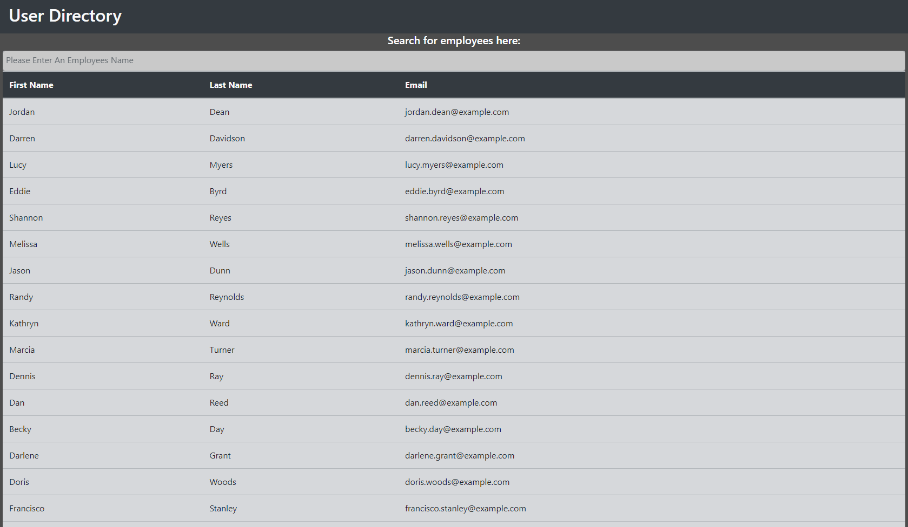

# User Directory

  

  ## Description
  A react application that takes users from randomUser.org's API and displays and sorts them through react states.

  Example of working product: [HERE](https://travis-witts.github.io/User-Directory/)

    
  ## Table of Contents
    
  - [Installation](#Installation)
  - [License](#License)
  - [Usage](#Usage)
  - [Testing](#Testing)
  - [Questions](#Questions)
 
  ## Usage
  This is deployed on github pages which can be found on the link above.

  ## Screenshot of the app:

  
    
  ## License
    
  This repository is covered under the [MIT](https://opensource.org/licenses/MIT) licensing.
    
  ## Contributing
  Contributions in the form of pull requests and emails are welcome.
    
  ## Testing
  No tests are included.
    
  ## Questions
    
  If you have any more questions regarding this or any other projects contact me at my [GitHub](https://github.com/Travis297/), or [email](mailto:travis.witts@outlook.com).